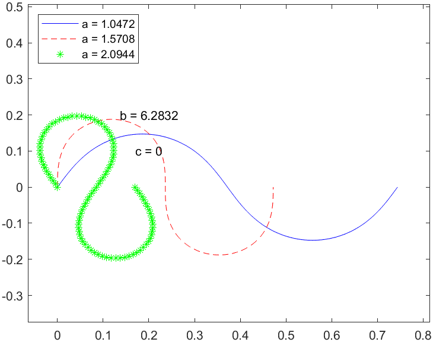
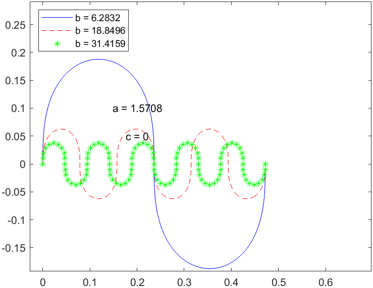
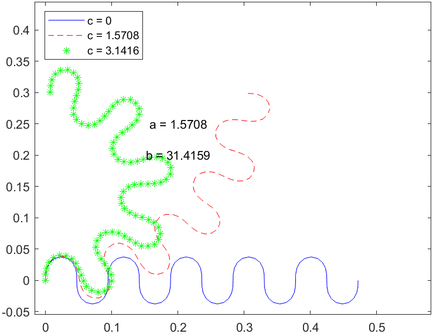

# 蛇形机器人步态

### 介绍
使用MuJoCo开源物理引擎，仿真实现蛇形机器人各种步态。注意: 某些浏览器下公式无法正常显示。读者可阅读[**pdf版本**](README_zh.pdf)或通过Pycharm或Visual Studio Code等编辑器安装Markdown插件查看.

笔者编辑软件：PyCharm 2024.2.1 (Community Edition) [PyCharm历史版本](https://www.jetbrains.com/pycharm/download/other.html)
### 特色😆
包含MuJoCo模型、参考文献、中文注释的代码文件、步态讲解、前置基础知识说明和对部分论文的修正与补充等。[English version of README.md](./README.md)

### 步态内容
|      步态       |                                 代码                                 |                                                                               参考文献                                                                               |
|:-------------:|:------------------------------------------------------------------:|:----------------------------------------------------------------------------------------------------------------------------------------------------------------:|
|   **蜿蜒步态**    |       [Lateral_Undulation.py](./codes/Lateral_Undulation.py)       |                      [2002](./references/2002_Modeling_Analysis_and_Synthesis_of_Serpentine_Locomotion_with_a_Multilink_Robotic_Snake.pdf)                       |
|   **尺蠖步态**    |                 [Inchworm.py](./codes/Inchworm.py)                 |                                     [2009](./references/2009_Parameterized_and_Scripted_Gaits_for_Modular_Snake_Robots.pdf)                                      |
|   **弧形尺蠖**    |             [Inchworm_Arc.py](./codes/Inchworm_Arc.py)             |                                     [2009](./references/2009_Parameterized_and_Scripted_Gaits_for_Modular_Snake_Robots.pdf)                                      |
|   **S形尺蠖**    |               [Inchworm_S.py](./codes/Inchworm_S.py)               |                                     [2009](./references/2009_Parameterized_and_Scripted_Gaits_for_Modular_Snake_Robots.pdf)                                      |
|   **侧绕步态**    |              [Sidewinding.py](./codes/Sidewinding.py)              |                                     [2009](./references/2009_Parameterized_and_Scripted_Gaits_for_Modular_Snake_Robots.pdf)                                      |
|  **S形平面横滚**   |                [Rolling_S.py](./codes/Rolling_S.py)                |                      [2009](./references/2009_Generating_Gaits_for_Snake_Robots_by_Annealed_Chain_Fitting_and_Keyframe_Wave_Extraction.pdf)                      |
|   **爬竖直杆子**   |            [Pole_Climbing.py](./codes/Pole_Climbing.py)            |                                        [2013](./references/2013_Motion_Estimation_of_Snake_Robots_in_Straight_Pipes.pdf)                                         |
|   **爬水平管子**   |            [Pipe_Crawling.py](./codes/Pipe_Crawling.py)            |                                        [2013](./references/2013_Motion_Estimation_of_Snake_Robots_in_Straight_Pipes.pdf)                                         |
|   **弧形横滚**    |              [Rolling_Arc.py](./codes/Rolling_Arc.py)              |                                              [2015](./references/2015_Modeling_Rolling_Gaits_of_a_Snake_Robot.pdf)                                               |
|   **驼峰横滚**    |             [Rolling_Hump.py](./codes/Rolling_Hump.py)             |                                              [2015](./references/2015_Modeling_Rolling_Gaits_of_a_Snake_Robot.pdf)                                               |
|   **仿鳗步态**    |                 [Eel-like.py](./codes/Eel-like.py)                 |                  [2017](./references/2017_An_Experimental_Investigation_of_Path_Following_for_an_Underwater_Snake_Robot_with_a_Caudal_Fin.pdf)                   |
|   **螺旋波传递**   |                             |                   [2017](./references/2017_Implementation_of_Helical_Wave_Propagation_Motion_in_Snake_Robot_Moving_on_Exterior_of_a_Pipe.pdf)                    |
|   **履带步态**    |                  [Crawler.py](./codes/Crawler.py)                  |                     [2018](./references/2018_Gait_Design_for_a_Snake_Robot_by_Connecting_Curve_Segments_and_Experimental_Demonstration.pdf)                      |
|  **履带步态转弯**   |     [Crawler_Turning_Form.py](./codes/Crawler_Turning_Form.py)     |                     [2018](./references/2018_Gait_Design_for_a_Snake_Robot_by_Connecting_Curve_Segments_and_Experimental_Demonstration.pdf)                      |
| **履带步态横滚恢复**  | [Crawler_Rolling_Recovery.py](./codes/Crawler_Rolling_Recovery.py) |                     [2018](./references/2018_Gait_Design_for_a_Snake_Robot_by_Connecting_Curve_Segments_and_Experimental_Demonstration.pdf)                      |
|   **越过法兰盘**   |   [Climbing_over_a_Flange.py](./codes/Climbing_over_a_Flange.py)   |                     [2018](./references/2018_Gait_Design_for_a_Snake_Robot_by_Connecting_Curve_Segments_and_Experimental_Demonstration.pdf)                      |
|  **爬竖/斜梯子**   |          [Ladder_Climbing.py](./codes/Ladder_Climbing.py)          |                                                 [2018](./references/2018_Ladder_Climbing_with_a_Snake_Robot.pdf)                                                 |
|  **C-足波步态**   |                  [C-Pedal.py](./codes/C-Pedal.py)                  |                  [2021](./references/2021_Hoop_Passing_Motion_for_a_Snake_Robot_to_Realize_Motion_Transition_Across_Different_Environments.pdf)                  |
|  **C2-足波步态**  |                 [C2-Pedal.py](./codes/C2-Pedal.py)                 |                                                      [2023](./references/2023_面向灾后环境的蛇形机器人重构设计及运动控制研究.pdf)                                                       |
|  **R-履带步态**   |                [R-Crawler.py](./codes/R-Crawler.py)                |                       [2023](./references/2023_Extension_and_Experimental_Demonstration_of_Gait_Transition_Network_for_a_Snake_Robot.pdf)                        |
|  **H-履带步态**   |                [H-Crawler.py](./codes/H-Crawler.py)                |                       [2023](./references/2023_Extension_and_Experimental_Demonstration_of_Gait_Transition_Network_for_a_Snake_Robot.pdf)                        |
|  **螺旋伸缩步态**   |                                    |                                                         [2023](./references/2023_蛇形机器人杆件攀爬跨越运动控制研究.pdf)                                                          |
|  **S-足波步态**   |                  [S-Pedal.py](./codes/S-Pedal.py)                  |                   [2024](./references/2024_A_Unified_Motion_Modeling_Approach_for_Snake_Robots_Gaits_Generated_with_Backbone_Curve_Method.pdf)                   |
|  **S形管上翻滚**   |                                     |           [2024](./references/2024_S-Shaped_Rolling_Gait_Designed_using_Curve_Transformations_of_a_Snake_Robot_for_Climbing_on_a_Bifurcated_Pipe.pdf)            |
|   **摆荡绕杆**    |                                          | [2025](./references/2025_A_Maneuverable_Winding_Gait_for_Snake_Robots_Based_on_a_Delay-Aware_Swing_and_Grasp_Framework_Combining_Rules_and_Learning_Methods.pdf) |
|   **螺旋步态**    |                [Spiraling.py](./codes/Spiraling.py)                |                              [2025](./references/2025_Novel_Gaits_for_Snake_Robot_Navigation_in_Complex_External_Pipe_Networks.pdf)                              |
| **窗口化滚动螺旋步态** |                               |                              [2025](./references/2025_Novel_Gaits_for_Snake_Robot_Navigation_in_Complex_External_Pipe_Networks.pdf)                              |
|   **反螺旋步态**   |                                       |                             [2025](./references/2025_Snake_Robot_with_Opposing_Helix_Gait_for_Transporting_Cylindrical_Objects.pdf)                              |
|    **...**    |                                                                    |                                                                                                                                                                  |

### 论文复现内容
- 2024_A_Unified_Motion_Modeling_Approach_for_Snake_Robots_Gaits_Generated_with_Backbone_Curve_Method
  - 利用运动模型做运动预测

### 论文修正与补充✨
- 2018_Gait_Design_for_a_Snake_Robot_by_Connecting_Curve_Segments_and_Experimental_Demonstration
  - 第4页，图的编号有误;
  - 第4页，表2中最下面三行的扭转角应为- (pi / 2);
  - 在此补充爬法兰步态的Case B的示意图[Climbing_over_a_Flange_CaseB](./images/Climbing_over_a_Flange_CaseB.png)。
- 2017_Implementation_of_Helical_Wave_Propagation_Motion_in_Snake_Robot_Moving_on_Exterior_of_a_Pipe
- 2018_Helical_Wave_Propagation_Motion_for_a_Snake_Robot_on_a_Vertical_Pipe_Containing_a_Branch
  - 上述两篇文献作者相同，研究内容高度相似，2018年的公式推到更详细，但公式均存在图不对文情况。遇到去看2006年[文献](./references/2006_Study_on_the_3D_Shape_of_Active_Cord_Mechanism.pdf)即可。
- 2018_Ladder_Climbing_with_a_Snake_Robot
  - 第3页，公式9，倒数第二个等号应为≤。
- 2021_Hoop_Passing_Motion_for_a_Snake_Robot_to_Realize_Motion_Transition_Across_Different_Environments
  - 第7页，公式15，不应是2倍的关系。
- 2024_A_Unified_Motion_Modeling_Approach_for_Snake_Robots_Gaits_Generated_with_Backbone_Curve_Method
  - 第5页，公式7，笔者理解是$$W_G = 2r_1cos\frac{\beta}{2} + 2r_2sin\frac{\beta}{2}$$
  - 第6页，公式9，笔者理解是（理解可能有误）$$\textbf{d}_{curve} = \Delta\textbf{s}_h + \textbf{d}_{slip}$$
  - 第7页，公式16，笔者理解是$$\phi = arccos(\frac{\textbf{d}_{curve}\cdot\textbf{e}_x}{|\textbf{d}_{curve}|})$$
  - 第10页，实验A，首段第4行，β=1.287。
  - 第11页，实验B，Y方向上机器人的移动距离为负。

### Shift Control
现有3种“代表性”操作：

①最常规，shift control为线性操作，见[2018论文](./references/2018_Gait_Design_for_a_Snake_Robot_by_Connecting_Curve_Segments_and_Experimental_Demonstration.pdf)；

②多个目标曲线合并为新的目标曲线，shift control为线性操作，见[2021论文](./references/2021_Hoop_Passing_Motion_for_a_Snake_Robot_to_Realize_Motion_Transition_Across_Different_Environments.pdf)；

③shift control不再是简单的线性操作，而是多部分的同时不同向操作，见[2025论文](./references/2025_Snake_Robot_with_Opposing_Helix_Gait_for_Transporting_Cylindrical_Objects.pdf).

### 准备🦐
- 知识
  - Python **[必要]**
  - MuJoCo [b站中文视频教程](https://www.bilibili.com/video/BV1wMdHYVEnx?spm_id_from=333.788.videopod.sections&vd_source=7a02bcb69ff53d02d5749b97cdd79fdc)
  - 微分几何-曲线论 [b站视频课程](https://www.bilibili.com/video/BV1K54y1a7cf/?spm_id_from=333.1007.top_right_bar_window_custom_collection.content.click&vd_source=7a02bcb69ff53d02d5749b97cdd79fdc) [飞书文档笔记](./materials/Differential_Geometry_Study_Notes_Curve_Theory.pdf) [b站视频-弗雷内公式的几何理解](https://www.bilibili.com/video/BV1zT421U794?vd_source=7a02bcb69ff53d02d5749b97cdd79fdc&spm_id_from=333.788.videopod.sections)
  - 骨干曲线法 （结合[2006年文献](./references/2006_Study_on_the_3D_Shape_of_Active_Cord_Mechanism.pdf)、[2017年文献](./references/2017_Implementation_of_Helical_Wave_Propagation_Motion_in_Snake_Robot_Moving_on_Exterior_of_a_Pipe.pdf)和[2018年文献](./references/2018_Helical_Wave_Propagation_Motion_for_a_Snake_Robot_on_a_Vertical_Pipe_Containing_a_Branch.pdf)，可彻底理解掌握该方法）
  - 曲线段拼接法 [2018年TRO文献](./references/2018_Gait_Design_for_a_Snake_Robot_by_Connecting_Curve_Segments_and_Experimental_Demonstration.pdf)（结合微分几何-曲线论、骨干曲线法，可彻底理解掌握该方法）
- 软件
  - Anaconda
  - Pycharm
> 1. 笔者环境配置见**environment.yaml**。安装Anaconda后，可通过命令``conda env create -f environment.yaml``复现环境
> 
> 2. 单独安装MuJoCo，使用命令``pip install mujoco``

### 内容详解🦘
- **蜿蜒步态**
> 前置基础知识：初等数学（三角函数）、微积分（尤其定积分的定义）和微分几何（曲线弧长参数、曲线曲率）。

[1] S.Hirose, Biologically Inspired Robots: Snake-Like Locomotors and Manipulators. New York, NY: Oxford University Press, 1993.

[2] Saito M, Fukaya M, Iwasaki T. Modeling, Analysis, and Synthesis of Serpentine Locomotion with a Multilink Robotic Snake[J]. IEEE control systems magazine, 2002, 22(1): 64-81.
**************
>下述内容参考自文献[2]，文献[2]又参考自文献[1]。若需要文献[1]的电子版可联系笔者。

***Serpenoid Curve***

> 曲率方程为
> $$\rho(s) = -2K_n \pi \alpha_0 \cdot \frac{1}{L} \sin\left( \frac{2K_n \pi}{L} s \right) + c$$
> 积分可得切向角$$\theta(s) = \alpha_0 \cos\left( \frac{2K_n \pi}{L} s \right) + cs$$
> 抽象后可对应下式

在x-y平面，若过原点的曲线满足
$$
x(s)=\int_0^scos(\xi_\sigma)d\sigma,\ \ \ \ y(s)=\int_0^ssin(\xi_\sigma)d\sigma,\ \ \ \ \xi_\sigma:=acos(b\sigma)+c\sigma \tag{1.1}
$$
其中a、b、c为标量，s为弧长（表示从原点到该点的曲线长度），则称该曲线为一条Serpenoid曲线。

参数a决定了曲线的波动程度，参数b决定了单位长度内的周期数，参数c决定了宏观的圆形形状。可视化如下图所示。[可视化代码](./codes/Serpentine_Curve_Params_zh.m)
<figure>

</figure>

文献[1]：Serpenoid曲线的曲率是个正弦曲线函数，可得
$$
\kappa(s)=\sqrt{(\frac{\mathrm{d}^2x}{\mathrm{d}s^2})^2+(\frac{\mathrm{d}^2y}{\mathrm{d}s^2})^2}=\vert absin(bs)-c\vert \tag{1.2}
$$
> 然而，文献[2]并没有给出Serpenoid曲线的推导过程。下面尝试对上式进行推导。注：下面内容部分生成于[DeepSeek](https://www.deepseek.com/)。

1. **定义曲率** 假设Serpenoid曲线的曲率$\kappa(s)$是弧长$s$的函数，且具有周期性。例如：
$$
\kappa(s)=Asin(\omega s)+c \tag{2.1}
$$
2. **建立微分方程** 设曲线的切线与某固定方向的夹角为$\theta(s)$，则曲线的切向量可表示为$\vec{T}(s)=(cos\theta(s), sin\theta(s))$。由微分几何曲线论知识可得：
$$
\frac{\mathrm{d}\theta(s)}{\mathrm{d}s}=\kappa(s)
$$
两边同时对$s$积分可得：
$$
\theta(s)=\int_0^s(Asin(\omega \tau)+c)d\tau
$$
$$
\theta(s)=-\frac{A}{\omega}cos(\omega s)+cs+\theta_0
$$
由现实意义可知：$\theta(0)=0$，即$\theta_0=0$。因此
$$
\theta(s)=-\frac{A}{\omega}cos(\omega s)+cs \tag{2.2}
$$
若记$\theta=\xi,s=\sigma,\omega=b,A=-ab$，对$(2.1)$与$(2.2)$进行部分替换，可得
$$
\kappa(s)=-absin(bs)+c
$$
$$
\xi(\sigma)=acos(b\sigma)+c\sigma
$$
这与$(1.1)$的夹角、$(1.2)$相一致。
3. **积分得到坐标** 对切向量积分可得到曲线的坐标：
$$
x(s)=\int_0^scos\theta(\tau)d\tau,\ \ \ \ y(s)=\int_0^ssin\theta(\tau)d\tau
$$
这与$(1.1)$的坐标公式相一致。
> 上述内容可加深对Serpenoid曲线的理解，但假设$\kappa(s)$为正弦曲线的理由还需要进一步阅读文献 **[1]**。
> 
> 下述内容给出$n-1$个关节（joints），$n$个片段（links, segments），$n+1$个点（points）的蛇形机器人对Serppenoid曲线的近似 **（离散化）**。

设蛇形机器人总长度为1，则每个片段长$1/n$。$x(s),y(s),0\leq s\leq 1$可表示Serpenoid曲线。$s_i:=i/n(i=0,...,n)$可表示$n+1$个点，其中$s_i:=i/n(i=1,...,n-1)$表示$n-1$个**关节点**。由定义可知（需掌握定积分的几何意义）：
$$
x_i=\sum_{k=1}^i\frac{1}{n}cos(acos(\frac{kb}{n})+\frac{kc}{n}),\ \ \ \ y_i=\sum_{k=1}^i\frac{1}{n}sin(acos(\frac{kb}{n})+\frac{kc}{n})
$$
连接$n+1$个点$(x_i,y_i)$，可得n个直线片段对Serpenoid曲线的近似。

记第$i$个片段与$x$轴的逆时针方向夹角为$\theta_i$，由几何意义可得
$$
tan(\theta_i)=\frac{y_i-y_{i-1}}{x_i-x_{i-1}}=\frac{sin(acos(ib/n)+ic/n)}{cos(acos(ib/n)+ic/n)}
$$
$$
\theta_i=acos(\frac{ib}{n})+\frac{ic}{n},\ \ \ \ i=1,...,n
$$
决定离散Serpenoid曲线的相对角（**关节点**处的角度）由下式可得：
$$
\phi_i:=\theta_i-\theta_{i+1},\ \ \ \ i=1,...n-1
$$
$$
\phi_i:=a(cos(\frac{ib}{n})-cos(\frac{(i+1)b}{n}))-\frac{c}{n}
$$
由和差化积公式
$$
cos\alpha - cos\beta=-2sin(\frac{\alpha+\beta}{2})sin(\frac{\alpha-\beta}{2})
$$
可得
$$
\phi_i:=-2asin(\frac{ib}{n}+\frac{b}{2n})sin(-\frac{b}{2n})-\frac{c}{n}
$$
记$\alpha:=a\vert sin(\frac{\beta}{2})\vert,\beta:=\frac{b}{n},\gamma:=-\frac{c}{n}$则
$$
\phi_i:=-2asin(i\beta+\frac{\beta}{2})sin(-\frac{\beta}{2})+\gamma
$$
$$
\phi_i:=\alpha sin(i\beta+\frac{\beta}{2})+\gamma
$$
可知相邻相对角的相位差为$\beta$。
> 至此可得文献[2]中的表达式。下面给出蛇形机器人物理样机实现蜿蜒步态的函数表达式。

***Serpentine Locomotion***
$$
\phi_i(t)=\alpha sin(\omega t+(i-1)\beta)+\gamma,\ \ \ \ (i=1,...,n-1)
$$
-------------
- **尺蠖步态** 

亦称行波（Inchworm）步态，可视为蛇身偏转90度的蜿蜒步态。

-------------
- **弧形尺蠖** 

尺蠖步态基础上，偏航关节给非零值，使其稳定不易倾斜，可实现转弯运动。

-------------
- **S形尺蠖**

尺蠖步态基础上，偏航关节前后给相反非零值，使其稳定不易倾斜，可实现直线运动。

-------------
- **侧绕步态**
$$
\phi_i(t)=
\begin{cases}
\alpha_1 sin(\omega_1 t+\beta_1 i)  & (i:odd) \\
\alpha_2 sin(\omega_2 t+\beta_2 i+\lambda)  & (i:even) 
\end{cases}
$$
-------------
- **S形平面横滚** 
$$
\phi_i(t)=
\begin{cases}
\alpha_1 sin(\Omega_1 i+ \delta_1)sin(\omega_1t)  & (i:odd) \\
\alpha_2 sin(\Omega_2 i+ \delta_2)sin(\omega_2t + \delta)  & (i:even) 
\end{cases}
$$
-------------
- **爬竖直杆子**

v较小时可通过夹持管道外壁实现爬杆子。
$$
\phi_i(t)=
\begin{cases}
A sin(\omega t+v i)  & (i:odd) \\
A sin(\omega t+v i+\frac{\pi}{2})  & (i:even) 
\end{cases}
$$
-------------
- **爬水平管子**

v较大时可通过挤压管道内壁实现爬管子。
$$
\phi_i(t)=
\begin{cases}
A sin(\omega t+v i)  & (i:odd) \\
A sin(\omega t+v i+\frac{\pi}{2})  & (i:even) 
\end{cases}
$$
-------------
- **弧形横滚**
$$
\phi_i(t)=
\begin{cases}
\alpha_1 sin(\omega_1 t)  & (i:odd) \\
\alpha_2 sin(\omega_2 t+\lambda)  & (i:even) 
\end{cases}
$$
-------------
- **驼峰横滚**
> 前置基础知识：骨干曲线法。

形式上相当于弧形横滚的中部局部抬起，可用于过障碍物。

-------------
- **仿鳗步态**

形式上相当于蜿蜒步态的变种，从蛇头到蛇尾，关节摆动幅度依次增大。
$$
\phi_i(t)=\alpha (n-i)/(n+1)sin(\omega t+(i-1)\beta)+\gamma,\ \ \ \ (i=1,...,n-1)
$$
-------------
- **螺旋波传递**
> 前置基础知识：骨干曲线法。

项目未给出实现，若有幸发出论文后，则开源相关代码😆。

-------------
- **履带步态**
> 前置基础知识：曲线段拼接法。
**************
- **履带步态转弯**
> 前置基础知识：履带步态。
**************
- **履带步态横滚恢复**
> 前置基础知识：履带步态。
**************
- **越过法兰盘**
> 前置基础知识：曲线段拼接法。

若有幸发出论文后，给出笔者对本步态的讨论😆。
**************
- **爬竖/斜梯子**
> 前置基础知识：曲线段拼接法。

本步态很不稳定。
**************
- **C-足波步态**
> 前置基础知识：曲线段拼接法。
**************
- **C2-足波步态**
> 前置基础知识：曲线段拼接法。

此步态在构型上与S-Pedal步态等价。C-足波步态结合shift part可实现TP类型运动（详见[论文](./references/2021_Hoop_Passing_Motion_for_a_Snake_Robot_to_Realize_Motion_Transition_Across_Different_Environments.pdf)），而本步态不能。
**************
- **R-履带步态**
> 前置基础知识：履带步态。
**************
- **H-履带步态**
> 前置基础知识：履带步态。
**************
- **螺旋伸缩步态**
> 前置基础知识：曲线段拼接法。

项目未给出实现。闲暇时实现。
**************
- **S-足波步态**
> 前置基础知识：曲线段拼接法。

已用两种方法实现S-足波步态的转弯。其中一种不是笔者的思路，不方便给出。另外一种，正计划做相关实验。若有幸发出论文后，则开源相关代码😆。
**************
- **S形管上翻滚**
> 前置基础知识：曲线段拼接法。

无复现该步态的打算。
**************
- **摆荡步态**
> 前置基础知识：强化学习。

目前笔者未考虑强化学习。若后续考虑强化学习，则考虑复现。
**************
- **螺旋步态**

复现过程发现，该步态仅适用于关节数n较小情况，否则在计算指数时会报错超出计算范围。
**************
- **窗口化滚动螺旋步态**

项目未给出实现。闲暇时实现。
**************
- **反螺旋步态**

项目未给出实现。闲暇时实现。
**************

## 联系我😊
邮箱: xjxf0923@gmail.com 3332407087@qq.com

微信: xjxf0923

笔者简介：INFJ-A，98年男，2025级博士研究生。通过本项目，期望可以对本领域新手有所帮助。

***
> markdown语法 https://markdown.com.cn/basic-syntax/
> 
> Emoji表情 https://emojipedia.org/

